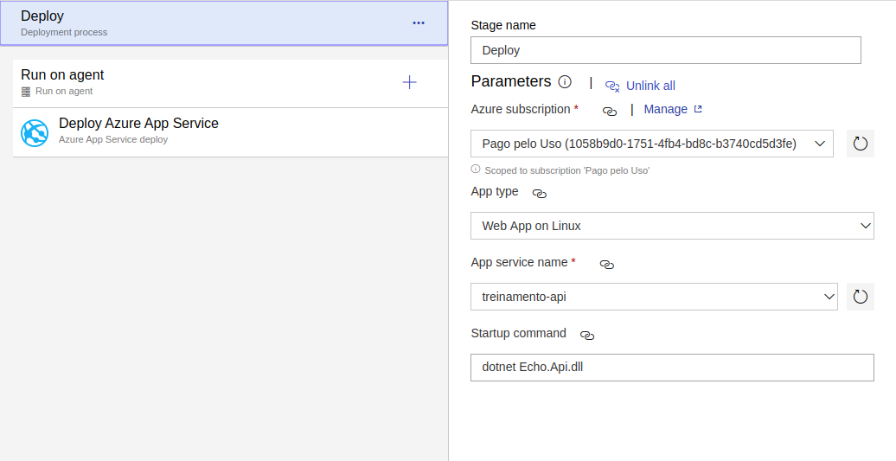
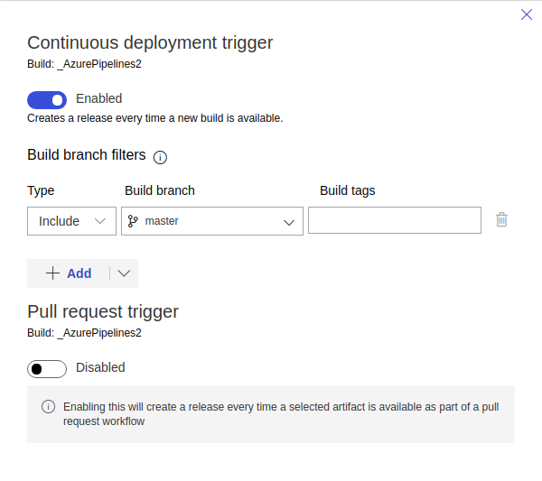

# Walkthrough Azure Pipelines

## Agenda

* Steps < Jobs < Stages
* Agentes
* Triggers
* Pipelines
  * Build
    * Compilação do código (build)
    * Testes (coverage e report)
    * Publicação de artefatos
  * Release
    * Deploy

## Build simples

``` yaml
variables:
  BuildConfiguration: Release
  EchoSln: 'Echo.sln'

steps: # [ script | bash | pwsh | powershell | checkout | task | templateReference ]
  - bash: dotnet restore
    displayName: Restore

  - bash: dotnet build $(EchoSln) -c $(buildConfiguration)
    displayName: Build

# - task: DotNetCoreCLI@2
#   displayName: Build
#   command: build
#   inputs:
#     projects: $(EchoSln)
#     arguments: '--configuration $(buildConfiguration)'
```

## Configurando o pool e a imagem do agente

``` yaml
pool:
  # name: string
  # demands: string | [ string ] # condições que os agentes devem atender
  vmImage: 'ubuntu-18.04' #, 'windows-2019' ou 'macOS-10.14'. Válido somente utilizando o MS-hosted pool
```

## Melhorando a estrutura com stages e jobs

``` yaml
stages: # agrupador lógico da pipeline para separação de responsabilidade (ex.: build, qa, e etc)
- stage: Build
  jobs: # sequencia de passos executados em um agente
    - job: building_application
      displayName: Building application
      # dependsOn: string | [ string ]
      # condition: string
      # strategy:
      #   parallel: # parallel strategy
      #   matrix: # matrix strategy
      #   maxParallel: number # máximo de jobs da matriz para serem executados simultaneamente
      # continueOnError: boolean  # 'true', se deve executar os jobs seguintes
      # pool: pool # configurações do Pool do job
      # workspace:
      #   clean: outputs | resources | all # o que limpar antes do job executar
      # container: containerReference # container para executar o job dentro
      # timeoutInMinutes: number
      # cancelTimeoutInMinutes: number
      # variables: { string: string }
      # services: { string: string | container } # containers para serem executados como serviços
      steps: # [ script | bash | pwsh | powershell | checkout | task | templateReference ]
        # ...
```

## Strategy

### Matrix

Cria cópias de um job com diferentes inputs. É útil para executar um build em múltiplas plataformas ou com diferentes versões de uma dependência. 

Exemplo:

  * Windows, MacOS e Linux;
  * Python 3.5, 3.6 e 3.7.

``` yaml
strategy:
  matrix:
    linux:
      imageName: 'ubuntu-18.04'
    mac:
      imageName: 'macOS-10.14'
    windows:
      imageName: 'windows-2019'

pool:
  vmImage: $(imageName)
```

### Parallel

Roda os jobs em paralelo. 

* Projetos privados possuem apenas um job paralelo, podendo ser adquirido mais;
* Projetos públicos possuem 10 jobs paralelos grátis e não possuem limite de jobs paralelos nos agentes próprios.

## Configurando triggers

Por padrão realiza o build de todas as branchs, mas podemos especificar somente algumas através dos triggers:

``` yaml
trigger:
  branches:
    include:
      - master
      - develop
      - feature/*
      - hotfix/*
  paths:
    exclude:
      - docs/*
      - readme.md
```

Outros tipos de triggers: 
 * Tags
 * PR 
 * Scheduling

## Stage de QA

``` yaml
  - stage: QA
    jobs:
      - job: executing_qa_analysis
        displayName: Executing QA analysis
        steps:
          - task: DotNetCoreCLI@2
            displayName: Run tests
            inputs:
              command: test
              projects: Echo.sln
              arguments: '-c $(buildConfiguration) --logger trx --collect:"XPlat Code Coverage" -- RunConfiguration.DisableAppDomain=true'

          - task: DotNetCoreCLI@2
            displayName: Install ReportGenerator tool
            inputs:
              command: custom
              custom: tool
              arguments: install --tool-path . dotnet-reportgenerator-globaltool

          - script: ./reportgenerator -reports:$(Agent.TempDirectory)/**/coverage.cobertura.xml -targetdir:$(Build.SourcesDirectory)/coverlet/reports -reporttypes:"Cobertura"
            displayName: Create reports

          - task: PublishTestResults@2
            displayName: Publish test results
            inputs:
              testRunner: VSTest
              testResultsFiles: '**/*.trx'

          - task: PublishCodeCoverageResults@1
            displayName: Publish code coverage
            inputs:
              codeCoverageTool: Cobertura
              summaryFileLocation: $(Build.SourcesDirectory)/coverlet/reports/Cobertura.xml
```

## Stage de publicação de artefatos

``` yaml
- stage: publish_artifacts
  displayName: Publish artifacts
  jobs:
    - job: generate_publish
      displayName: Generate publish
      steps:
      - task: DotNetCoreCLI@2
        displayName: Publish
        inputs:
          command: publish
          arguments: '-c $(BuildConfiguration) -o $(Build.ArtifactStagingDirectory)'
          publishWebProjects: True
          zipAfterPublish: True

      - task: PublishBuildArtifacts@1
        displayName: Publish build artifacts
        inputs:
          pathtoPublish: '$(Build.ArtifactStagingDirectory)' 
          artifactName: 'echo-api'
```

## Criação do pipeline de release

Criar pipeline de release para o Azure App Service



Adicionar trigger de deploy contínuo da branch master



## Extra: Configuração de versionamento semântico

Será utilizada a ferramenta [GitVersion](https://gitversion.readthedocs.io/en/latest/) que possui um [plugin para o Azure Pipelines](https://marketplace.visualstudio.com/items?itemName=GitTools.usegitversion) para o gerenciamento semântico de versões.

``` yaml
- stage: Version
  jobs:
    - job: configure_version
      displayName: Configure version
      steps:
        - task: gittools.gitversion.gitversion-task.GitVersion@5
          displayName: GitVersion
          inputs:
            useConfigFile: true
            configFilePath: GitVersion.yml
```

<!-- ## Desafio

Utilizar o Azure Pipelines para realizar o build e publicação da imagem da API para a sua conta do Docker Hub.

 -->

## Links úteis

* [Documentação do Azure Pipelines](https://docs.microsoft.com/en-us/azure/devops/pipelines/?view=azure-devops)
* [Post do Vincent Driessen sobre Gitflow](https://nvie.com/posts/a-successful-git-branching-model/)
* [Especificação do versionamento semântico](https://semver.org/)